## Shade

[](https://hub.docker.com/r/yourorg/shade)
[](https://www.rust-lang.org)
[](#security)
[](LICENSE)

**Shade** is a modern, self‑hosted **Identity & Access Management** platform built with Rust. Designed for developers who need enterprise-grade authentication without the complexity, Shade provides complete **OIDC/OAuth2** support, social login integration, and forward authentication for reverse proxies.

> **🚀 Perfect for**: Homelab setups, startup authentication, microservice security, and any scenario requiring reliable, self-hosted identity management.

---

## 🎯 Key Features

### 🔐 Authentication & Authorization
* ✅ **OpenID Connect (OIDC)** - Full OIDC provider with discovery
* ✅ **OAuth 2.0** - Authorization Code, Client Credentials, Token Introspection
* ✅ **PKCE Support** - Proof Key for Code Exchange (RFC 7636)
* ✅ **Multi-Factor Auth** - TOTP with backup codes
* ✅ **Social Login** - Google, GitHub, Microsoft Entra ID integration
* ✅ **JWT Security** - RS256/ES256 signing with automatic key rotation

### 🌐 Integration & Deployment  
* ✅ **Forward Authentication** - Nginx/Traefik reverse proxy integration
* ✅ **Admin Web Interface** - User, client, and policy management
* ✅ **Docker Ready** - Multi-stage builds with health checks
* ✅ **High Performance** - Built with Rust and Axum for speed
* ✅ **Production Ready** - PostgreSQL + Redis with connection pooling

### 📊 Observability & Security
* ✅ **Audit Logging** - Complete authentication event tracking  
* ✅ **Prometheus Metrics** - Built-in monitoring endpoints
* ✅ **Security Hardened** - Argon2id hashing, secure sessions, rate limiting
* ✅ **Privacy Focused** - Self-hosted with no external dependencies

### 🔮 Coming Soon
* 🚧 **WebAuthn/FIDO2** - Passwordless authentication
* 🚧 **WASM Admin UI** - Modern, interactive management interface
* 🚧 **SCIM Support** - User provisioning and management
* 🚧 **SAML 2.0** - Enterprise identity federation

---

## 🏗️ Architecture

Shade follows a modern, cloud-native architecture designed for reliability and scalability:

```mermaid
graph TB
    Users[👥 Users] --> RP[🔀 Reverse Proxy<br/>Nginx/Traefik]
    Apps[📱 Applications] --> RP
    
    RP --> Shade[🛡️ Shade Identity Provider]
    
    Shade --> DB[(🐘 PostgreSQL<br/>Users, Clients, Audit)]
    Shade --> Redis[(🔴 Redis<br/>Sessions, Cache)]
    
    Shade -.-> Google[🔵 Google OAuth]
    Shade -.-> GitHub[⚫ GitHub OAuth] 
    Shade -.-> Entra[🔵 Microsoft Entra]
    
    subgraph "Shade Core"
        API[🔌 REST API]
        OIDC[🆔 OIDC Provider]
        OAuth[🔐 OAuth2 Server]
        Auth[🔑 Authentication]
        Admin[⚙️ Admin Interface]
    end
```



### Technology Stack

| Component | Technology | Purpose |
|-----------|------------|---------|
| **Runtime** | Rust + Tokio | High-performance async execution |
| **Web Framework** | Axum | Modern HTTP server with middleware |
| **Database** | PostgreSQL | Persistent user and client data |
| **Cache/Sessions** | Redis | Fast session storage and caching |
| **Cryptography** | Ring + jsonwebtoken | JWT signing and verification |
| **Password Hashing** | Argon2id | Secure password storage |
| **Deployment** | Docker + Compose | Containerized deployment |

---

## 🚀 Quick Start

Get Shade running in under 5 minutes with Docker Compose:

### 1. Clone and Configure

```bash
git clone https://github.com/your-org/shade.git
cd shade
cp .env.example .env
```

### 2. Generate Secrets

```bash
# Generate a secure cookie secret
export SHADE_COOKIE_SECRET="base64:$(openssl rand -base64 48)"
echo "SHADE_COOKIE_SECRET=$SHADE_COOKIE_SECRET" >> .env
```

### 3. Start Services

```bash
docker-compose up -d
```

### 4. Access Admin Interface

Open http://localhost:8080/admin and sign in with:
- **Email**: `admin@example.com` 
- **Password**: `ChangeMe!Long1`

### Complete Docker Compose Example

```yaml
version: "3.9"
services:
  shade:
    build: .  # or use: image: ghcr.io/your-org/shade:latest
    container_name: shade
    restart: unless-stopped
    environment:
      # Core Configuration
      - RUST_LOG=info
      - SHADE_ISSUER=https://auth.localhost:8080
      - SHADE_EXTERNAL_URL=https://auth.localhost:8080
      - SHADE_COOKIE_SECRET=base64:your_generated_secret_here
      
      # Database & Cache
      - DATABASE_URL=postgres://shade:shadepass@db/shade
      - REDIS_URL=redis://redis:6379

      # Admin Bootstrap
      - SHADE_ADMIN_EMAIL=admin@example.com
      - SHADE_ADMIN_PASSWORD=ChangeMe!Long1

      # OAuth Providers (configure as needed)
      # See docs/providers/ for detailed setup guides
      
    ports:
      - "8080:8080"
    depends_on:
      - db
      - redis
    healthcheck:
      test: ["CMD", "curl", "-f", "http://localhost:8080/health"]
      interval: 30s
      timeout: 10s
      retries: 3

  db:
    image: postgres:16
    environment:
      - POSTGRES_DB=shade
      - POSTGRES_USER=shade  
      - POSTGRES_PASSWORD=shadepass
    volumes:
      - shade-dbdata:/var/lib/postgresql/data
    healthcheck:
      test: ["CMD-SHELL", "pg_isready -U shade -d shade"]
      interval: 10s

  redis:
    image: redis:7-alpine
    healthcheck:
      test: ["CMD", "redis-cli", "ping"]
      interval: 10s

volumes:
  shade-dbdata:
```

> 💡 **Production tip**: Replace localhost URLs with your actual domain and set up proper TLS certificates.

---

## 📖 Documentation & Setup Guides

### Core Documentation
- **[Complete Documentation](DOCS.md)** - Comprehensive setup, configuration, and API reference
- **[Development Guide](DOCS.md#development)** - Contributing and local development setup
- **[Security Guide](DOCS.md#security)** - Best practices and security considerations

### OAuth Provider Setup
- **[🔵 Google Setup](docs/providers/GOOGLE.md)** - Complete Google OAuth 2.0 configuration
- **[⚫ GitHub Setup](docs/providers/GITHUB.md)** - GitHub OAuth Apps integration guide  
- **[🔵 Azure/Entra Setup](docs/providers/AZURE.md)** - Microsoft Entra ID (Azure AD) configuration

### Integration Examples
- **[Nginx Forward Auth](DOCS.md#forward-authentication)** - Protect apps behind reverse proxies
- **[Traefik Integration](DOCS.md#traefik-configuration)** - Traefik middleware configuration
- **[Kubernetes Deployment](DOCS.md#kubernetes-deployment)** - Production Kubernetes manifests

---

## 🔧 What's Included

This implementation provides a **complete, production-ready identity provider** with:

### ✅ Fully Implemented Core Features
- Complete OIDC/OAuth2 server with all required endpoints
- JWT signing with RS256 and automatic key rotation
- Multi-provider social authentication (Google, GitHub, Microsoft)
- PostgreSQL database with comprehensive schema and migrations  
- Redis-based session management with automatic cleanup
- Argon2id password hashing with account lockout protection
- TOTP multi-factor authentication with backup codes
- Comprehensive audit logging for all authentication events
- Prometheus metrics endpoint for monitoring
- Admin web interface for user and client management
- Docker containerization with multi-stage builds and health checks

### 🚧 Ready for Extension  
- **WASM Admin UI** - Framework in place for modern SPA interface
- **Forward Auth** - Endpoint implemented, ready for reverse proxy integration
- **Additional Providers** - Extensible provider system for adding new OAuth sources
- **Advanced Security** - Foundation for WebAuthn, rate limiting, and more

### 📁 Project Structure
```
shade/
├── 🦀 src/              # Rust source code  
│   ├── handlers/        # HTTP request handlers (auth, OIDC, admin)
│   ├── services/        # Core business logic (auth, JWT, OIDC, sessions)
│   ├── providers/       # OAuth provider implementations  
│   ├── models/          # Database models and schemas
│   └── config/          # Configuration management
├── 🗃️ migrations/       # PostgreSQL database migrations
├── 🐳 Docker setup     # Production containerization  
├── 📚 docs/            # Comprehensive documentation
└── 🔧 Development      # Makefile, configs, examples
```

---

## 🌐 API Endpoints

Shade exposes all standard OIDC/OAuth2 endpoints:

| Endpoint | Purpose |
|----------|---------|
| `/.well-known/openid-configuration` | OpenID Connect Discovery |
| `/jwks.json` | JSON Web Key Set |
| `/authorize` | OAuth2 Authorization |
| `/token` | Token Exchange |
| `/userinfo` | User Information |
| `/login` | User Authentication |
| `/admin` | Admin Interface |
| `/forward-auth` | Reverse Proxy Authentication |
| `/health` | Health Check |
| `/metrics` | Prometheus Metrics |

---

## 🔐 Security Features

Shade implements enterprise-grade security from the ground up:

- **🛡️ Secure by Default**: PKCE required, secure cookies, CSRF protection
- **🔑 Strong Cryptography**: Argon2id hashing, RS256/ES256 JWT signing  
- **🔒 Session Security**: HTTPOnly cookies, SameSite protection, automatic expiry
- **📝 Comprehensive Logging**: All authentication events tracked and auditable
- **⚡ Rate Limiting**: Protection against brute force and abuse
- **🔄 Token Rotation**: Refresh token rotation and automatic key rotation

---

## Reverse Proxy (Nginx) – Forward‑Auth

```nginx
# Forward-auth endpoint (internal)
location = /_shade_auth {
  internal;
  proxy_pass              http://127.0.0.1:8080/forward-auth;
  proxy_set_header        Host $host;
  proxy_set_header        X-Original-URI $request_uri;
  proxy_set_header        X-Real-IP $remote_addr;
  proxy_set_header        X-Forwarded-Proto $scheme;
}

# Protected app
location /app/ {
  auth_request /_shade_auth;
  error_page 401 = @shade_signin;

  # forward identity headers set by Shade
  proxy_set_header X-User  $upstream_http_x_user;
  proxy_set_header X-Email $upstream_http_x_email;
  proxy_pass http://127.0.0.1:9000;
}

location @shade_signin {
  return 302 https://auth.example.com/login?rd=$scheme://$host$request_uri;
}
```

> Alternatively, integrate using full OIDC at the edge (e.g., `auth_jwt` or OpenResty/lua) and validate tokens against Shade’s JWKS.

---

## Provider Setup

### Google

* Create OAuth 2.0 Client (Web) → Authorized redirect URI:
  `https://auth.example.com/callback/google`
* Set `OIDC_GOOGLE_CLIENT_ID`, `OIDC_GOOGLE_CLIENT_SECRET`, `OIDC_GOOGLE_REDIRECT_URI`.

### GitHub

* OAuth App → Authorization callback URL:
  `https://auth.example.com/callback/github`
* Set `OIDC_GITHUB_CLIENT_ID`, `OIDC_GITHUB_CLIENT_SECRET`, `OIDC_GITHUB_REDIRECT_URI`.

### Microsoft Entra ID

* App registration → Redirect URI (Web):
  `https://auth.example.com/callback/entra`
* Set `OIDC_ENTRA_TENANT_ID`, `OIDC_ENTRA_CLIENT_ID`, `OIDC_ENTRA_CLIENT_SECRET`, `OIDC_ENTRA_REDIRECT_URI`.

---

## Well‑Known Endpoints

When Shade runs with `SHADE_ISSUER=https://auth.example.com`:

* OpenID Configuration: `/.well-known/openid-configuration`
* JWKS: `/jwks.json`
* Auth endpoints: `/authorize`, `/token`, `/userinfo`, `/introspect`, `/revoke`
* Login/Logout: `/login`, `/logout`
* Forward‑Auth: `/forward-auth`
* Admin UI/API: `/admin`, `/api/admin/*`

---

## Environment Variables

| Variable                | Purpose                                               |
| ----------------------- | ----------------------------------------------------- |
| `SHADE_ISSUER`          | Public issuer URL (must match reverse proxy TLS host) |
| `SHADE_EXTERNAL_URL`    | Used for redirects/links if different from bind addr  |
| `SHADE_COOKIE_SECRET`   | Base64 secret for signing/encryption of cookies       |
| `SHADE_JWT_SIGNING_ALG` | `RS256` (default), `ES256`, etc.                      |
| `DATABASE_URL`          | Postgres connection string                            |
| `REDIS_URL`             | Redis connection string                               |
| `SHADE_ADMIN_EMAIL`     | Initial admin user email                              |
| `SHADE_ADMIN_PASSWORD`  | Initial admin user password                           |
| `OIDC_*`                | Provider client IDs/secrets/redirects as above        |

> See `.env.example` for the full list.

---

## Security

* **Modern TLS** via your reverse proxy (HSTS recommended)
* **PKCE required** for public clients; refresh token rotation
* **Argon2id** password hashes, TOTP MFA, recovery codes
* **SameSite=Lax** cookies, HTTPOnly, Secure; CSRF on non‑GET
* **JWK rotation**, kid‑pinned tokens, short‑lived access tokens
* **Rate limiting** on auth and token endpoints
* **Audit log** for admin and auth events

---

## 💻 Local Development

Get started with local development:

```bash
# Prerequisites: Rust 1.75+, PostgreSQL, Redis
git clone https://github.com/your-org/shade.git
cd shade

# Setup environment
make setup

# Start development services
docker-compose -f docker-compose.yml up -d db redis

# Run database migrations
make migrate

# Start development server with auto-reload
make dev-watch
```

Development server runs on `http://127.0.0.1:8080` with:
- Admin interface: `http://127.0.0.1:8080/admin`
- OIDC discovery: `http://127.0.0.1:8080/.well-known/openid-configuration`
- Health check: `http://127.0.0.1:8080/health`

### Available Make Targets

```bash
make dev          # Run development server
make dev-watch    # Run with auto-reload  
make test         # Run test suite
make build        # Build release binary
make docker-build # Build Docker image
make migrate      # Run database migrations
make cookie-secret # Generate secure cookie secret
```

---

## 🗺️ Roadmap

### ✅ v0.1 - Foundation (Current)
- Complete OIDC/OAuth2 implementation
- Social login providers (Google, GitHub, Microsoft)
- PostgreSQL + Redis architecture
- Docker containerization  
- Comprehensive documentation

### 🚧 v0.2 - Enhanced Security
- WebAuthn/FIDO2 passwordless authentication
- Advanced rate limiting and abuse protection
- WASM-based admin interface
- Enhanced audit logging and monitoring

### 🔮 v0.3 - Enterprise Features
- SCIM user provisioning
- SAML 2.0 identity federation
- Multi-tenant organization support
- Kubernetes Helm charts
- High availability deployment guides

### 🎯 v1.0 - Production Scale
- Full audit trail and compliance features
- Advanced key management and rotation
- Backup and restore capabilities  
- FIPS-ready cryptographic configuration
- Performance optimization and caching

---

## 🤝 Contributing

We welcome contributions! Please see our [Development Guide](DOCS.md#development) for:

- Setting up your development environment
- Understanding the codebase structure
- Adding new OAuth providers
- Running tests and ensuring code quality
- Submitting pull requests

### Quick Contribution Setup

```bash
# Fork the repository and clone your fork
git clone https://github.com/yourusername/shade.git
cd shade

# Create a feature branch
git checkout -b feature/your-feature-name

# Set up development environment
make setup
make dev

# Make your changes, test, and submit a PR!
```

---

## 📜 License

Shade is released under the [MIT License](LICENSE). 

Built with ❤️ for the self-hosted community.

---

## 🌟 Star History

If Shade helps you build better authentication, consider giving us a ⭐!

[](https://star-history.com/#your-org/shade&Date)

---

